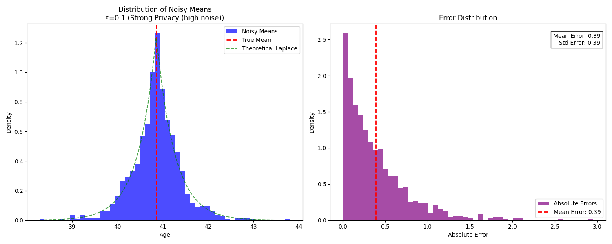
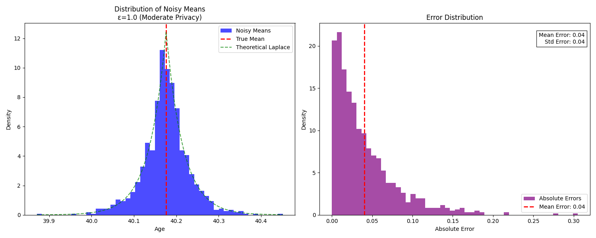
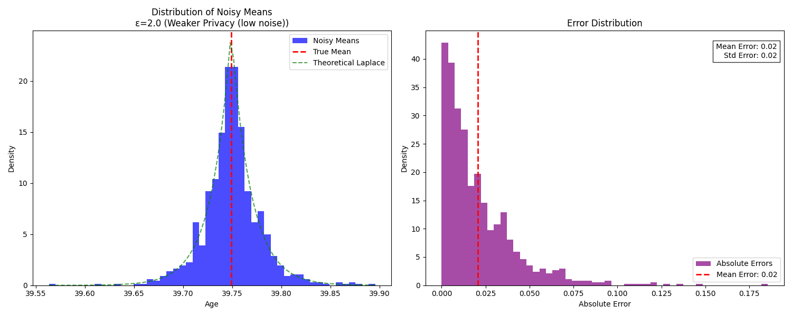
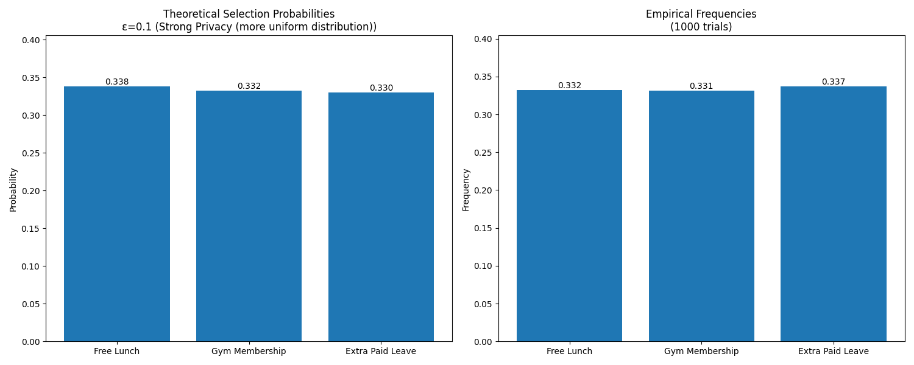
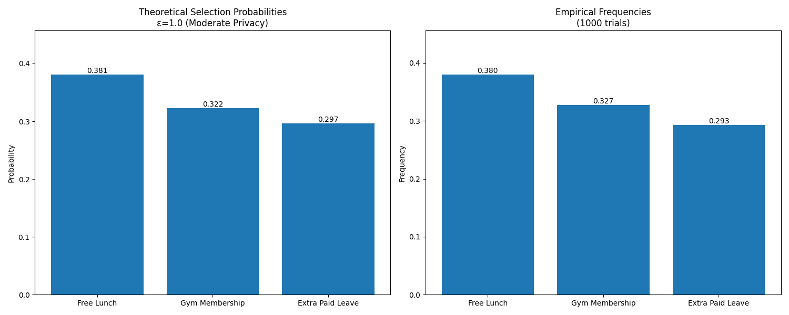
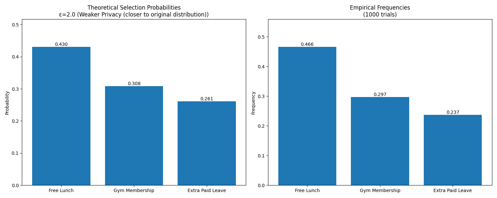

# Differential Privacy Mechanisms

The two fundamental mechanisms in differential privacy: the *Laplace Mechanism* and the *Exponential Mechanism*. Each mechanism is demonstrated with different privacy levels to illustrate the privacy-utility trade-off. Read more about it on [Substack](https://theailandscape.substack.com/p/the-art-of-controlled-noise-laplace)

## 1. Laplace Mechanism

The Laplace Mechanism adds calibrated random noise to numerical query results to ensure differential privacy. This demonstration shows its application in computing the mean age from a synthetic dataset.

### Privacy Levels
- **ε=0.1**: Strong privacy (high noise)
- **ε=1.0**: Moderate privacy
- **ε=2.0**: Weaker privacy (low noise)

### Implementation Details
- **Dataset**: 1000 synthetic age values uniformly distributed between 20 and 60 years
- **Query**: Mean age computation
- **Sensitivity**: (max_age - min_age) / n
- **Number of trials**: 1000 per privacy level

### Results

#### Strong Privacy (ε=0.1)
| Metric | Value |
|--------|-------|
| True Mean Age | 40.86 |
| Mean Absolute Error | 0.39 |
| Standard Deviation of Error | 0.39 |

**Key Observations**:
- Highest level of privacy protection
- Largest deviation from true mean (±0.39 years)
- Widest error distribution

#### Moderate Privacy (ε=1.0)
| Metric | Value |
|--------|-------|
| True Mean Age | 40.18 |
| Mean Absolute Error | 0.04 |
| Standard Deviation of Error | 0.04 |

**Key Observations**:
- Balanced privacy-utility trade-off
- Reasonable accuracy (±0.04 years deviation)
- Moderate error distribution

#### Weaker Privacy (ε=2.0)
| Metric | Value |
|--------|-------|
| True Mean Age | 39.75 |
| Mean Absolute Error | 0.02 |
| Standard Deviation of Error | 0.02 |

**Key Observations**:
- Highest accuracy
- Smallest error range (±0.02 years)
- Tightest error distribution

## 2. Exponential Mechanism

The Exponential Mechanism is used for selecting discrete options while preserving privacy. This demonstration shows its application in a private voting scenario.

### Privacy Levels
- **ε=0.1**: Strong privacy (more uniform distribution)
- **ε=1.0**: Moderate privacy
- **ε=2.0**: Weaker privacy (closer to original distribution)

### Implementation Details
- **Scenario**: Workplace perk selection
- **Options**: Free Lunch, Gym Membership, Extra Paid Leave
- **Original votes**: 120, 80, 60 respectively
- **Number of trials**: 1000 per privacy level

### Results

#### Strong Privacy (ε=0.1)
| Option | Original Votes | True Proportion | Private Selection Probability | Empirical Frequency |
|--------|---------------|-----------------|----------------------------|-------------------|
| Free Lunch | 120 | 0.462 | 0.338 | 0.332 |
| Gym Membership | 80 | 0.308 | 0.332 | 0.331 |
| Extra Paid Leave | 60 | 0.231 | 0.330 | 0.337 |

**Key Observations**:
- Near-uniform distribution regardless of vote counts
- Highest privacy protection
- Limited utility preservation

#### Moderate Privacy (ε=1.0)
| Option | Original Votes | True Proportion | Private Selection Probability | Empirical Frequency |
|--------|---------------|-----------------|----------------------------|-------------------|
| Free Lunch | 120 | 0.462 | 0.381 | 0.380 |
| Gym Membership | 80 | 0.308 | 0.322 | 0.327 |
| Extra Paid Leave | 60 | 0.231 | 0.297 | 0.293 |

**Key Observations**:
- Balanced privacy-utility trade-off
- Preserves general preference ordering
- Moderate probability smoothing

#### Weaker Privacy (ε=2.0)
| Option | Original Votes | True Proportion | Private Selection Probability | Empirical Frequency |
|--------|---------------|-----------------|----------------------------|-------------------|
| Free Lunch | 120 | 0.462 | 0.430 | 0.466 |
| Gym Membership | 80 | 0.308 | 0.308 | 0.297 |
| Extra Paid Leave | 60 | 0.231 | 0.261 | 0.237 |

**Key Observations**:
- Closest to original vote distribution
- Maintains clear preference ordering
- Lower privacy protection

## Summary

These demonstrations illustrate how different privacy levels (ε values) affect the trade-off between privacy protection and utility preservation in differential privacy mechanisms:

- **Strong Privacy (ε=0.1)**: Maximizes privacy at the cost of utility
- **Moderate Privacy (ε=1.0)**: Provides a balanced trade-off
- **Weaker Privacy (ε=2.0)**: Prioritizes utility while maintaining some privacy guarantees